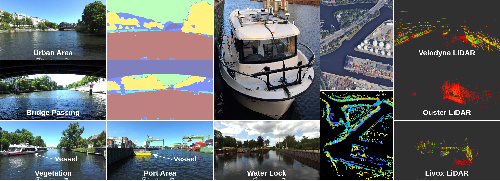
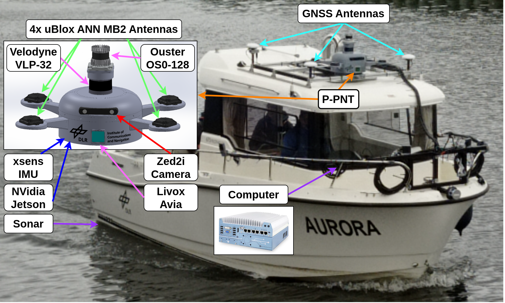
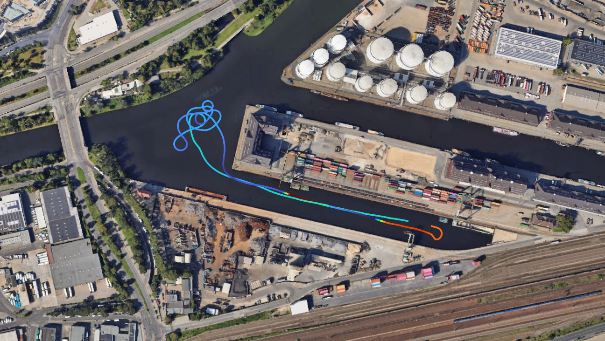
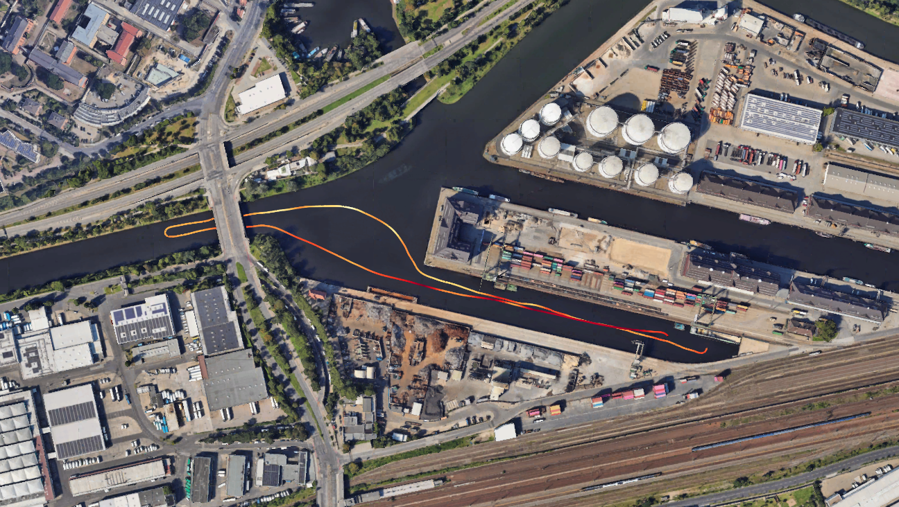
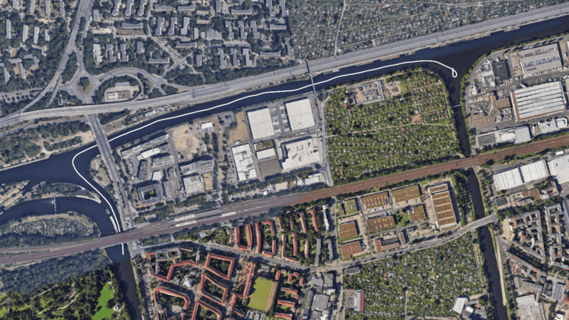
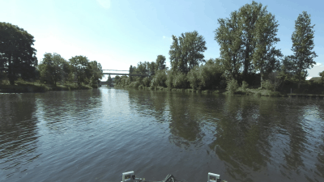

# Berlin Waters

> 
Repository under development.

## An Inland Waterway Transport Dataset for Multi-Sensor SLAM and Semantic Segmentation

## Overview

Berlin Waters is a multimodal dataset collected on inland waterways in Berlin to support research in SLAM, perception, and semantic understanding.

## Dataset Highlights

- **22 scenes** spanning about **70 km** and **9 hours** of operation in Berlin’s inland waterways
- **Diverse environments**: urban canals, ports, locks, bridges, vegetation, and dynamic vessel traffic
- **Multi-sensor data** from Velodyne, Ouster, and Livox LiDARs, a stereo camera, IMU, and multi-antenna GNSS, stored in **ROS 2 bag format**
- **Post-processed reference trajectories** plus raw GNSS observations in **RINEX format**
- **3,344** semantically annotated images across **seven classes**

## Publication and Citation

Citation information will be provided soon.

## Contact

For questions, collaboration requests, or dataset access inquiries, please contact the authors at iulian.filip@dlr.de

## Sensor Setup

The data-collection platform "Aurora" measures 6.5 m long × 2.6 m wide × 2.8 m high and is equipped with the following sensors: 
- **LiDAR 1** (Velodyne VLP32C, 10 Hz, HFOV 360°, VFOV 40°)
  - ROS 2 topic: `/VLP32/velodyne_points`
- **LiDAR 2** (Ouster OS0-128, 10 Hz, HFOV 360°, VFOV 90°, IMU recorded at 100 Hz)
  - ROS 2 topics: `/ouster/points`, `/ouster/imu`
- **LiDAR 3** (Livox Avia, 10 Hz, HFOV 70.4°, VFOV 77.2°, IMU recorded at 100 Hz)
  - ROS 2 topic: `/livox/lidar`, `/livox/imu`
- **Stereo camera × 1** (StereoLabs ZED 2i, 1920×1080, 10 Hz, plus IMU recorded at 400 Hz)
  - ROS 2 topics: `/zed/zed_node/left/image_rect_color/compressed`, `/zed/zed_node/right/image_rect_color/compressed`, `/zed/zed_node/left/camera_info`, `/zed/zed_node/right/camera_info`, `/zed/zed_node/imu/data`
- **IMU × 1** (xsens MTi-680G, 400 Hz, and 1 u-blox GNSS antenna connected to the xsens IMU (4 Hz))
  - ROS 2 topics: `/xsens/imu/data`, `/xsens/gnss`
- **u-blox GNSS antennas × 3** (connected to u-blox M8T EVK receivers (5 Hz))
  - ROS 2 topics: `/ublox_1/fix`, `/ublox_1/fix_velocity`, `/ublox_2/fix`, `/ublox_2/fix_velocity`, `/ublox_3/fix`, `/ublox_3/fix_velocity`
- **JAVAD GNSS receivers with roof-mounted geodetic antennas × 3** (raw GNSS observables, 2 Hz)
  - No ROS 2 topics; data is stored in RINEX files
- **Sonar × 1** (stern-mounted, 0.1 Hz)
  - ROS 2 topic: `/water_depth`

## Intrinsic and Extrinsic Parameters

The coordinates transformation between multiple sensors, and intrinsic parameters of camera are the same for all scenes and can be found via link_to_params(Intrinsic and Extrinsic Parameters).

## Scene Overview

The following table summarizes the duration, traveled distance, sensor availability, and operating conditions of each recorded scene.

<!--
| Scene | Date of Collection | File Size | Duration [min] | Distance [km] | Velodyne LiDAR | Ouster LiDAR | Livox LiDAR | ZED 2i Camera | Xsens IMU | 3× u-blox | Xsens GNSS | 3× RINEX | Sonar | Description |
|:---|:---|:---|---:|---:|:---:|:---:|:---:|:---:|:---:|:---:|:---:|:---:|:---:|:---|
| `berlin_00` | May 22, 2025 | 17.8 GB | 8.8 | 1.36 | ✓ | ✗ | ✓ | ✓ | ✓ | ✓ | ✓ | ✓ | ✓ | Port area, aggressive maneuvers, loop closure |
| `berlin_01` | May 22, 2025 | 21.5 GB | 10.3 | 1.42 | ✓ | ✗ | ✓ | ✓ | ✓ | ✓ | ✓ | ✓ | ✓ | Port area, bridge passage, loop closure |
| `berlin_02` | May 22, 2025 | 34.9 GB | 17.0 | 2.26 | ✓ | ✗ | ✓ | ✓ | ✓ | ✓ | ✓ | ✓ | ✓ | Port area, loop closure, vessel traffic |
| `berlin_03` | May 22, 2025 | 27.7 GB | 13.7 | 1.96 | ✓ | ✗ | ✓ | ✓ | ✓ | ✓ | ✓ | ✓ | ✓ | Port area, loop closure, vessel traffic |
| `berlin_04` | May 22, 2025 | 29.1 GB | 13.9 | 1.85 | ✓ | ✗ | ✓ | ✓ | ✓ | ✓ | ✓ | ✓ | ✓ | Port and vegetation-dominated areas, loop closure, bridges |
| `berlin_05` | May 22, 2025 | 41.2 GB | 19.7 | 2.67 | ✓ | ✗ | ✓ | ✓ | ✓ | ✓ | ✓ | ✓ | ✓ | Port and vegetation-dominated areas, loop closure, bridges |
| `berlin_06` | May 22, 2025 | 87.6 GB | 21.9 | 3.53 | ✓ | ✓ | ✓ | ✓ | ✓ | ✓ | ✓ | ✓ | ✓ | Vegetation-dominated area, loop closure |
| `berlin_07` | May 21, 2025 | 74.2 GB | 18.6 | 2.65 | ✓ | ✓ | ✓ | ✓ | ✓ | ✓ | ✓ | ✓ | ✓ | Urban area, bridge passage |
| `berlin_08` | May 22, 2025 | 48.9 GB | 12.3 | 0.42 | ✓ | ✓ | ✓ | ✓ | ✓ | ✓ | ✓ | ✓ | ✓ | Lock entry and exit |
| `berlin_09` | May 20, 2025 | 115.4 GB | 28.8 | 1.00 | ✓ | ✓ | ✓ | ✓ | ✓ | ✓ | ✓ | ✓ | ✗ | Lock entry and exit |
| `berlin_10` | May 21, 2025 | 92.3 GB | 42.9 | 6.10 | ✓ | ✗ | ✓ | ✓ | ✓ | ✓ | ✓ | ✓ | ✓ | Port, urban, and vegetation-dominated areas, narrow channel |
| `berlin_11` | May 20, 2025 | 371.5 GB | 88.4 | 11.94 | ✓ | ✓ | ✓ | ✓ | ✓ | ✓ | ✓ | ✓ | ✗ | Urban and vegetation-dominated areas, loop closure |
| `berlin_12` | May 21, 2025 | 229.8 GB | 111.8 | 14.90 | ✓ | ✗ | ✓ | ✓ | ✓ | ✓ | ✓ | ✓ | ✓ | Urban and vegetation-dominated areas, loop closure |
| `berlin_13` | May 21, 2025 | 31.7 GB | 14.7 | 1.81 | ✓ | ✗ | ✓ | ✓ | ✓ | ✓ | ✓ | ✓ | ✓ | Narrow channel, bridge passage |
| `berlin_14` | May 21, 2025 | 42.6 GB | 19.8 | 2.79 | ✓ | ✗ | ✓ | ✓ | ✓ | ✓ | ✓ | ✓ | ✓ | Urban area, bridge passage |
| `berlin_15` | May 21, 2025 | 14.7 GB | 6.7 | 0.51 | ✓ | ✗ | ✓ | ✓ | ✓ | ✓ | ✓ | ✓ | ✓ | Urban and vegetation-dominated areas, vessel traffic |
| `berlin_16` | May 21, 2025 | 16.0 GB | 7.3 | 0.87 | ✓ | ✗ | ✓ | ✓ | ✓ | ✓ | ✓ | ✓ | ✓ | Urban and vegetation-dominated areas, vessel traffic |
| `berlin_17` | May 21, 2025 | 24.8 GB | 15.1 | 2.23 | ✓ | ✗ | ✗ | ✓ | ✓ | ✓ | ✓ | ✓ | ✓ | Vegetation-dominated area, vessel traffic, bridges |
| `berlin_18` | May 20, 2025 | 61.2 GB | 14.8 | 2.09 | ✓ | ✓ | ✓ | ✓ | ✓ | ✓ | ✓ | ✓ | ✗ | Urban and vegetation-dominated areas, vessel traffic, bridges |
| `berlin_19` | May 20, 2025 | 68.7 GB | 16.4 | 2.14 | ✓ | ✓ | ✓ | ✓ | ✓ | ✓ | ✓ | ✓ | ✗ | Port area, loop closure, bridges, vessel traffic |
| `berlin_20` | May 20, 2025 | 84.5 GB | 19.5 | 2.28 | ✓ | ✓ | ✓ | ✓ | ✓ | ✓ | ✓ | ✓ | ✗ | Narrow channel, vessel traffic, bridges |
| `berlin_21` | May 20, 2025 | 50.0 GB | 12.0 | 1.84 | ✓ | ✓ | ✓ | ✓ | ✓ | ✓ | ✓ | ✓ | ✗ | Urban and vegetation-dominated areas, vessel traffic, bridges |

**Legend:** ✓ available; ✗ unavailable.

-->

<!-- Reduced summary table (columns up to Distance only) -->
| Scene | Date of Collection | File Size | Duration [min] | Distance [km] |
|:---|:---|---:|---:|---:|
| `berlin_00` | May 22, 2025 | 17.8 GB | 8.8 | 1.36 |
| `berlin_01` | May 22, 2025 | 21.5 GB | 10.3 | 1.42 |
| `berlin_02` | May 22, 2025 | 34.9 GB | 17.0 | 2.26 |
| `berlin_03` | May 22, 2025 | 27.7 GB | 13.7 | 1.96 |
| `berlin_04` | May 22, 2025 | 29.1 GB | 13.9 | 1.85 |
| `berlin_05` | May 22, 2025 | 41.2 GB | 19.7 | 2.67 |
| `berlin_06` | May 22, 2025 | 87.6 GB | 21.9 | 3.53 |
| `berlin_07` | May 21, 2025 | 74.2 GB | 18.6 | 2.65 |
| `berlin_08` | May 22, 2025 | 48.9 GB | 12.3 | 0.42 |
| `berlin_09` | May 20, 2025 | 115.4 GB | 28.8 | 1.00 |
| `berlin_10` | May 21, 2025 | 92.3 GB | 42.9 | 6.10 |
| `berlin_11` | May 20, 2025 | 371.5 GB | 88.4 | 11.94 |
| `berlin_12` | May 21, 2025 | 229.8 GB | 111.8 | 14.90 |
| `berlin_13` | May 21, 2025 | 31.7 GB | 14.7 | 1.81 |
| `berlin_14` | May 21, 2025 | 42.6 GB | 19.8 | 2.79 |
| `berlin_15` | May 21, 2025 | 14.7 GB | 6.7 | 0.51 |
| `berlin_16` | May 21, 2025 | 16.0 GB | 7.3 | 0.87 |
| `berlin_17` | May 21, 2025 | 24.8 GB | 15.1 | 2.23 |
| `berlin_18` | May 20, 2025 | 61.2 GB | 14.8 | 2.09 |
| `berlin_19` | May 20, 2025 | 68.7 GB | 16.4 | 2.14 |
| `berlin_20` | May 20, 2025 | 84.5 GB | 19.5 | 2.28 |
| `berlin_21` | May 20, 2025 | 50.0 GB | 12.0 | 1.84 |

## Scene Details

### `berlin_00`

| velodyne | ouster | livox | zed2i | xsens IMU + GNSS | 3× u-blox | 3× RINEX | Sonar |
|:---:|:---:|:---:|:---:|:---:|:---:|:---:|:---:|
| ✓ | ✗ | ✓ | ✓ | ✓ | ✓ | ✓ | ✓ |

<!-- 

 -->

  
  &nbsp;
  

**Comments:** This scene ..

### `berlin_01`

| velodyne | ouster | livox | zed2i | xsens IMU + GNSS | 3× u-blox | 3× RINEX | Sonar |
|:---:|:---:|:---:|:---:|:---:|:---:|:---:|:---:|
| ✓ | ✗ | ✓ | ✓ | ✓ | ✓ | ✓ | ✓ |

<!-- 

 -->

  
  &nbsp;
  

**Comments:** This scene ..

> Additional scene overview sections will be added progressively for the remaining scenes.

<!-- ### `berlin_21`

| Velodyne | Ouster | Livox | ZED 2i | Xsens IMU | 3× u-blox | Xsens GNSS | 3× RINEX | Sonar |
|:---:|:---:|:---:|:---:|:---:|:---:|:---:|:---:|:---:|
| ✓ | ✓ | ✓ | ✓ | ✓ | ✓ | ✓ | ✓ | ✗ |

**Comments:** This scene .. -->